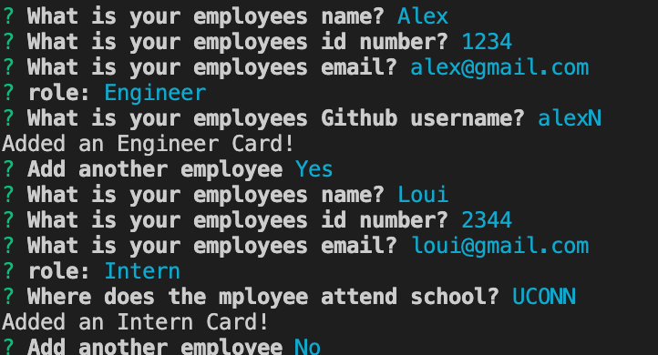
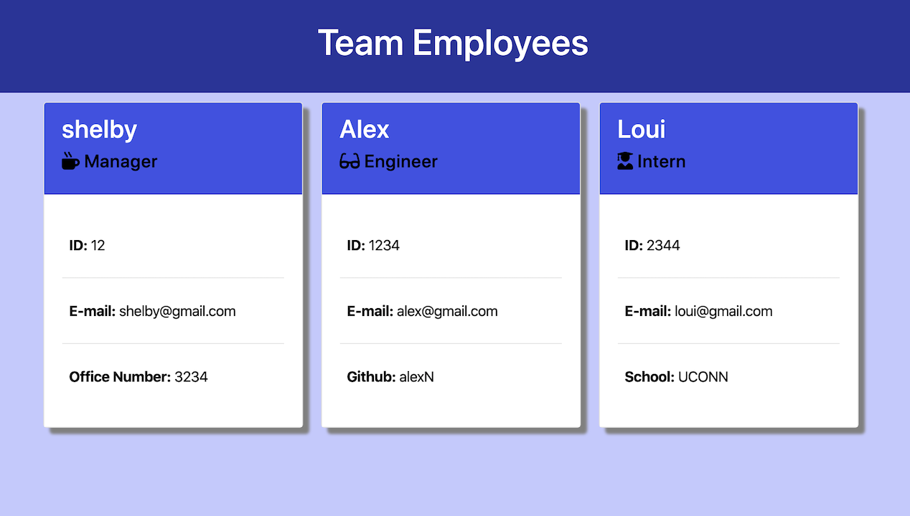

# Employee-Template-Engine

A CLI Node employee template engine that generates a webpage displaying a company's employees basic information.

##### View Demo Employee page:

https://shelbypalumbo.github.io/Template-Engine/

## User Story

As an Employer, I want to be able to display each employees name, role, and contact information, so that I can refer to a specific employee based on their role.

## Usage

The user will be prompted for their employees name, id, email, role, and additional parameters based on what they select as their role (Manager, Enginer, Intern).

Once all prompts are answered for each employee, select "No" to "Add another employee?". The employee cards will then append to the start of the html file and generate a full web page displaying all company employees.

## Programming Languages Used

- HTML
- CSS
- Javascript
- Node.js

### Additional Styling Framework

- Bootstrap | https://getbootstrap.com/
- Fontsawesome icons | https://fontawesome.com/icons?d=gallery&m=free
